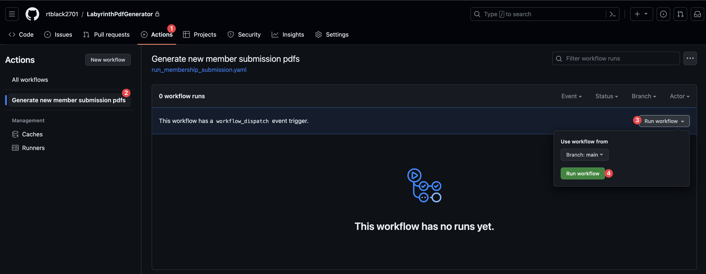
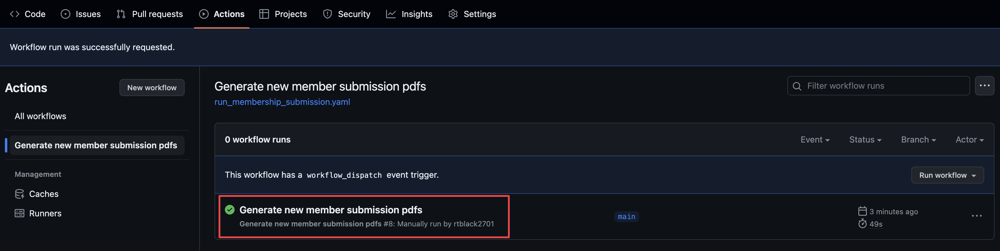
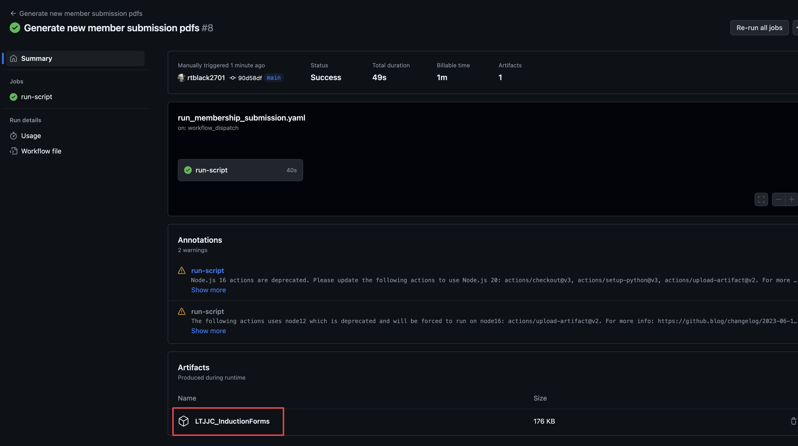

# Labyrinth PDF Generator

## Purpose
Python application designed to allow one parent/guardian to fill out a single membership form for multiple children and generate a separate PDF form for each child.

## Installation
1. Clone the repository: `git clone git@github.com:rtblack2701/LabyrinthPdfGenerator.git`
2. Install the required packages: `pip install -r requirements.txt`
3. Run the application: 

## Usage

### First-time use
Authenticate with Jotform API:
`python -m jotform_api/api_endpoints/authentication`

### Then:

**Run the `main` script to generate the PDFs:
The `main` script will call the following scripts in order:**

1. Get the form submission data:
    `jotform_api.api_endpoints.get_form_submissions`
2. Build the JSON file:
    `scripts/object_builder`
3. Clean the JSON file:
    `scripts/api_data_cleaner`
4. Generate the PDFs:
    `scripts/pdf_filler`
5. Overlay the PDFs with parent/guardian and coach signatures:
    `scripts/signature_overlay`

### Post-processing
1. Update the list of processed submissions
    `scripts.post_process_scripts.log_processed_submissions`
2. Zip the PDFs
    `scripts.post_process_scripts.zip_email_pdfs`
3. Clean up the directories
    `scripts.post_process_scripts.generated_file_removal`

## Manual Processing
If you need to manually process submissions, you can do so by running the `Generate new member submission pdfs` GitHub Action workflow.:

1. Navigate to the [Generate new member submission pdfs](https://github.com/rtblack2701/LabyrinthPdfGenerator/actions/workflows/run_membership_submission.yaml) action page.
2. Click the `Run workflow` button and 'Run Workflow` again.

3. Once the workflow has completed, download the generated PDFs from the `Artifacts` section.

